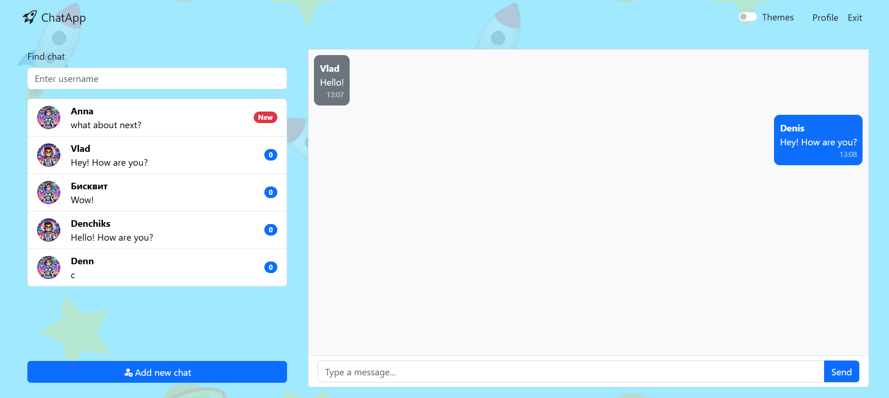
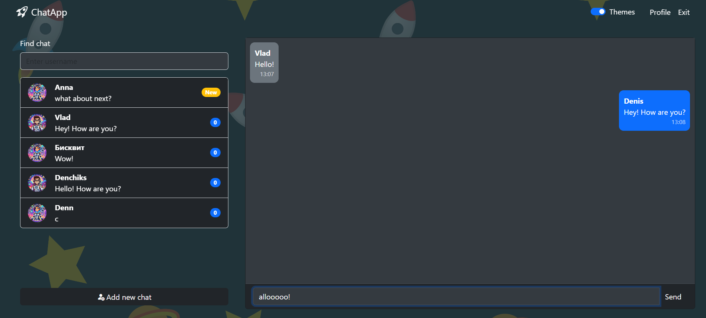
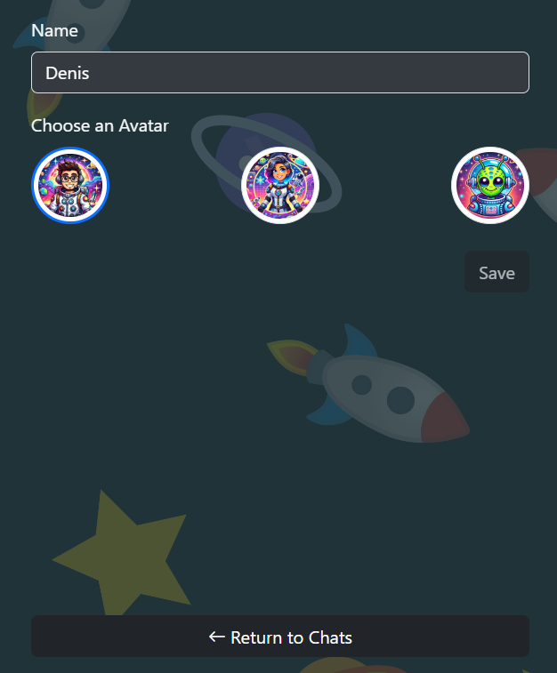

# ChatApp

**ChatApp** – это приложение для обмена сообщениями, позволяющее пользователям создавать личные профили, находить других участников и общаться с ними в режиме реального времени. все изменения мгновенно отображаются благодаря использованию облачной базы данных.

## 🚀 Основные функции и особенности

- **создание и редактирование профиля пользователя**: 
  пользователь может создать профиль при регистрации и редактировать его (пример интерфейса редактирования можно посмотреть [здесь](#редактирование-профиля)).
- **поиск пользователей**: 
  удобный поиск по базе зарегистрированных пользователей.
- **создание чатов**: 
  возможность начать диалог с любым пользователем (примеры интерфейса можно посмотреть [здесь](#смена темы и интерфейс чатов)).
- **смена темы интерфейса**: 
  пользователь может переключаться между светлой и тёмной темой (пример интерфейса можно посмотреть [здесь](#смена-темы-и-интерфейс-чатов)).

## 🛠️ Используемые технологии

### основной стек
- **React**: вся логика и рендеринг приложения.
- **Redux Toolkit**: для управления состоянием приложения.
- **React Router**: для реализации клиентского роутинга.
- **React-scroll**: для анимированного прокручивания контента.

### дополнительные библиотеки
- **Firebase Authentication**: авторизация пользователей через Firebase.
- **Formik** и **Yup**: удобная работа с формами и валидацией.
- **Bootstrap**: базовая верстка с использованием компонентов Bootstrap, стилизованных дополнительными CSS-правилами.

## 🏗️ Архитектура приложения
Проект разработан в классической архитектуре frontend-приложений:
- **компоненты**:
  реализованы изолированные и переиспользуемые элементы интерфейса.
- **pages**:
  основные страницы приложения, собранные из компонентов.

## 📂 Работа с данными
Клиент взаимодействует напрямую с базой данных **Cloud Firestore**, что обеспечивает:
- мгновенную передачу и обновление данных;
- обновление интерфейса без необходимости перезагрузки страницы.

## 📸 Примеры интерфейсов

### смена темы и интерфейс чатов

### редактирование профиля

---

ChatApp разработан как удобный и функциональный мессенджер, предоставляющий все необходимое для общения и взаимодействия пользователей в режиме реального времени. 💬
